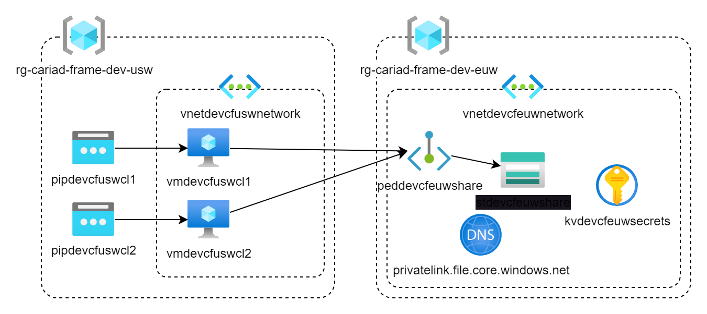

# Multi-client file share

## Introduction

    This project automates the provisioning of infrastructure using Terraform and bootstraps virtual machines (VMs) using a PowerShell script. The bootstrapping includes a process, which mounts a fileshare onto the virtual machine. The infrastructure includes resources across two regions: the EU and the US. The VMs are configured to access an Azure file share using private links and have the necessary software dependencies installed (e.g., .NET SDK).

## Prerequisites

- Terraform
- Azure CLI
- Powershell

## Architecture Diagram

## IaC approach

    We are using Terraform for our IaC strategy. The goal is to create a modularized, secure deployment

Terraform Code Structure

Resource Naming: The Terraform code uses locals to define the resource names based on the environment, project, and location.
    EU Resource Name: ${var.environment}${var.project_short_name}${var.location_short_eu}
    US Resource Name: ${var.environment}${var.project_short_name}${var.location_short_us}
    

Key Variables:
- var.environment: Defines the environment (e.g., dev, prod).
- var.project_short_name: A short identifier for the project.
- var.location_short_eu: Short identifier for the EU region.
- var.location_short_us: Short identifier for the US region.

Purpose

    The Terraform file standardizes resource naming across regions, ensuring that infrastructure in both regions follows a consistent naming convention for easier management and identification.

    Modular approach: We created several terraform modules to ensure clean & maintainable code. 

    Each module consists of three files:
    1. *inputs.tf* - contains all variables neccesary for the module
    2. *main.tf* - contains all resource deployments
    3. *outputs.tf* contains all variables, which we need in other modules
    
    The structure is as follows
    - main.tf
    - terraform.tfvars (only used for local development, can be created manually. Is handled by gitignore to not be checked in, as it contains secrets)
    modules
        module_1
        module_,,
        module_x
            inputs.tf
            main.tf
            outputs.tf

## Resource Definitions

    VM-Clients
    - VMs running with windows server, datacenter editio 2022. 
    - VMs can be replicated however often is required
    - Extensions are used, to ensure the mounting process & dependency management is run for each deployment
    - Accesable with RDP

    Storageaccount:
    - Standard storage account
    - Has a file share, which we later mount to the VMs
    - Private link to ensure security

    Keyvault: 
    -  Contains any secrets that we need along the way

    VNET:
    - We have two VNETs, one for each region. 
    - VNETs are peered with each other
    - We manage the firewall using SecurityGroups on the VNET level.

## VM Bootstrapping with PowerShell

*Script Overview*

The PowerShell script is executed on virtual machines to handle:

    Logging key actions for auditing and debugging purposes.
    Setting up the credentials to access an Azure file share.
    Installing the .NET 8 SDK, if not already present.

Parameters

The script accepts several input parameters for customization:

    $storageAccountName: The name of the Azure Storage account.
    $storageAccountKey: The key to access the storage account.
    $storagePrivateDomain: The private domain for the storage account (used for private endpoints).
    $fileshareName: The name of the file share in the storage account.
    $storageAccountConnectionString: The connection string for the storage account.

Logging

    Log File Paths:
        Bootstrapping log: C:\CustomScriptExtensionLogs\bootstrapping.log
        File share log: C:\CustomScriptExtensionLogs\fileshare.log
    Write-Log Function: The script includes a custom logging function to write timestamped log entries to the appropriate log files.

Credential and File Share Setup

    Set Connection String: The script sets the STORAGE_ACCOUNT_CONNECTION_STRING environment variable using the connection string parameter. This connection string is used by our benchmarking tool.
    Add Credentials: It stores the credentials using cmdkey so that they persist across reboots.
    Mount File Share: The script checks whether the Azure file share is already mounted. If not, it mounts the file share using the provided credentials.

## Networking and Connectivity

VNet Peering

The project provisions two Virtual Networks (VNets), one in the EU region and one in the US region. These VNets are peered to enable secure communication between resources in both regions without relying on the public internet.

    VNet A (EU): Contains the primary storage account with the Azure file share.
    VNet B (US): Hosts virtual machines that connect to the file share in VNet A via private endpoints.

Private Link for Storage Account

A key aspect of this project's security and network design is the use of Azure Private Link to securely connect resources to the storage account without exposing it to the public internet.

    Private Endpoints: The storage account in VNet A is accessible to VMs in VNet B via Private Link, which creates private endpoints. This ensures that the file share is accessible through internal networks only.

DNS Configuration

For Private Link to work seamlessly, proper DNS configuration is necessary to resolve the storage account's private endpoint domain name within the VNets.

    Private DNS Zone: A private DNS zone is associated with both VNets to resolve the private domain name of the storage account. The VMs in both VNets use this private DNS zone to reach the storage account via its private endpoint.

VM File Share Connectivity

    The PowerShell script sets up the VMs in VNet B to mount the file share located in VNet A using the Private Link configuration.
    The script ensures that the credentials for accessing the storage account are stored securely and persist across reboots.

## Troubleshooting

Log Files:

    Bootstrapping log: Captures details about the .NET SDK installation process and other bootstrapping activities.
    File share log: Logs actions related to mounting the Azure file share and setting up credentials.

Issues we encountered during development:

    - Failed to Set Credentials: Check the file share log if there are issues with credential management.
    - File Share Not Mounted: Ensure that the private link and network configurations are correct if the file share cannot be mounted.
    - .NET SDK Not Installed: Review the bootstrapping log for any download or installation failures during the .NET SDK setup.
    - CustomScriptExtension runs under a different user than when logged in. Some commands say that they have successfully executed, but they cause negative side effects. Setting credentials with cmdkey for example, never works because the corresponding registry entries are not created. The same goes for mounitng the network drive.  
Windows Machine:

    - There is a windows bug, where a programatically created fileshare will show as disconnected, but it still works. All features are unaffected, except that you cannot disconnect it. This needs to be looked at.
    - Creating a service needs to be done under specific user contexts. The CustomScriptExtensions Context has privledges, but seems to be behaving weirdly. Running a script directly from the machine gives different results.

## Ansible playbook configuration

Due to the short notice of the request, we were unable to implement Ansible playbooks as initially planned. The limited time available did not allow for the development, testing, and fine-tuning of Ansible configurations. Instead, we opted for Terraform, which allowed us to quickly provision and configure the required infrastructure in a more time-efficient manner, leveraging its declarative approach and our team's familiarity with the tool. This ensured that we met the deadline while maintaining the desired configuration outcomes.

## Performance measurement report

The project under `src/Benchmark` is designed to evaluate the performance of the Azure File Share by benchmarking file upload and download operations. The benchmarking is implemented using a .NET-based tool in conjunction with the BenchmarkDotNet library, providing detailed insights into the performance characteristics under different conditions.

### Benchmarking approach

The tool measures the performance of file transfers with PDF files of varying sizes: **0.5 MB, 1 MB, 2 MB, 4 MB,** and **10 MB**. Two key scenarios are tested:

- **Single-threaded operations**: A single file is uploaded or downloaded at a time, providing insight into sequential performance.
- **Multi-threaded operations**: 10 files are transferred in parallel, measuring how well our infrastructure implementation handles concurrent operations.

Each test is executed **50 times** to ensure robust statistical data, minimizing the impact of fluctuations. The tool then compiles and generates comprehensive statistics.

### Results
