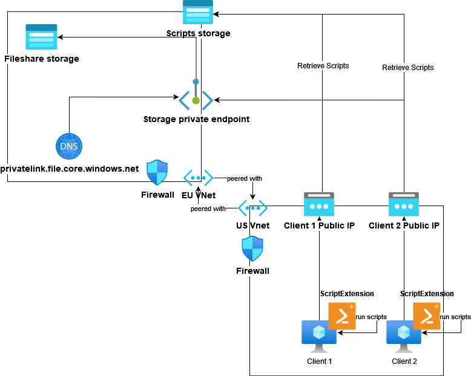

# Multi-Region File Share Solution

## Repository
[Link to Public Repository](https://github.com/Cluster-DE/cariad-eng-it-frame-wp01)

## Overview

This project automates infrastructure deployment using Terraform and sets up virtual machines (VMs) with a PowerShell-based bootstrapping process. This process mounts an Azure file share onto VMs, ensuring secure cross-region connectivity using Azure Private Link. Resources span two regions: Europe (EU) and the United States (US), and all VMs are equipped with essential software dependencies (e.g., .NET SDK).

## Requirements

- **Terraform**
- **Azure CLI**
- **PowerShell**

## Solution Architecture



## Infrastructure as Code (IaC)

We leverage **Terraform** to automate and modularize the deployment of resources, adhering to best practices for security and maintainability.

**Terraform Structure and Naming Conventions:**

Resources follow a standardized naming pattern based on the environment and region:
- **EU Resources:** \${var.environment}\${var.project_short_name}\${var.location_short_eu}
- **US Resources:** \${var.environment}\${var.project_short_name}\${var.location_short_us}

### Key Variables:
- `var.environment`: Specifies the environment (e.g., dev, prod).
- `var.project_short_name`: Abbreviated project identifier.
- `var.location_short_eu`: Short code for the EU region.
- `var.location_short_us`: Short code for the US region.

### Modular Design

We employ a modular approach for maintainability, where each module includes:
1. **inputs.tf**: Defines the required inputs for the module.
2. **main.tf**: Contains the resource definitions.
3. **outputs.tf**: Provides the outputs needed by other modules.

**Directory Structure:**
```
- main.tf
- terraform.tfvars (local development file, ignored in version control)
- modules/
  - module_1/
  - module_2/
  - module_x/
    - inputs.tf
    - main.tf
    - outputs.tf
```

## Resource Overview

### Virtual Machines
The VMs are not part of the tech task, however we decided to create VMs for simulating the clients and running the benchmarks with them. In particular, this allows better benchmark results independent from our local conncetivity. Below in the Performance measurement report section the benchmarking is described.

- **OS**: Windows 11
- **Replicability**: VM scaling as needed. Terraform can setup x VMs by just creating a new module call.
- **Scripts & Dependencies**: VMs use extensions to automate the mounting of the Azure file share and manage software dependencies. Accessible via RDP.

### Storage Account
- Standard storage account with an Azure file share.
- Secured using a private link.
- Option: [Azure File Sync](https://docs.microsoft.com/en-us/azure/storage/files/storage-sync-files-planning). It's a new service from Microsoft, primarily meant for hybrid cloud architecture. It optimizes file sharing & adds features like syncing existing Windows Server fileshares to a cloud-native fileshare, giving you the freedom to use other Cloud services like private endpoints on top.
We decided this to not be included in the PoC scope, but this can be a valid consideration.

### Key Vault
- Stores secrets and sensitive information for the project.

### Virtual Networks (VNets)
- Two VNets, one per region (EU and US).
- VNets are peered, with security managed at the VNet level using Network Security Groups (NSGs).

## CI/CD Infrastructure

We are utilizing GitHub Actions for our CI/CD Pipelines. With it, we are automating the deployment process of the infrastructure.

The default Terraform commands are sequentially called:
1. terraform init
2. terraform plan
3. terraform apply

To secure our pipeline parameters, we save them into our GitHub secrets. Additionally we use a environment specific .tfvars file for security uncritical parameters.

## PowerShell VM Bootstrapping

### Script Functions

Two scripts are involved:
1. **Service Creation Script**: Executed through Terraform, this script initializes the VM to set up the environment, including autostart for further scripts.
2. **Bootstrapping Script**: Uploaded via CustomScriptExtension and executed on startup, this script installs .NET SDK, configures the environment, and mounts the file share.

### Logging
- Both scripts log activities under `C:\CustomScriptLogs` for detailed process tracking and debugging.

## Secure Connection Concept / Networking Design

### VNet Peering

The solution creates two VNets (EU and US), peered to facilitate secure, internal communication across regions:
- **VNet A (EU)**: Hosts the primary storage account with the Azure file share.
- **VNet B (US)**: Contains VMs that access the file share through private endpoints.

### Private Link for Secure Access

Private Link secures access to the storage account, ensuring the file share is only reachable through the internal network:
- **Private Endpoints**: Enable VMs in VNet B to securely access the file share in VNet A.

### DNS Configuration

For Private Link to function properly, DNS must be configured to resolve private endpoints:
- **Private DNS Zone**: Ensures that both VNets can resolve the storage account's private domain.

### File Share Connectivity

The bootstrapping script configures VMs in VNet B to mount the file share securely using Private Link, ensuring that credentials persist across reboots.

## Ansible playbook configuration

The limited time available did not allow for the development, testing, and fine-tuning of Ansible configurations. Instead, we opted for Terraform, which allowed us to quickly provision and configure the required infrastructure in a more time-efficient manner, leveraging its declarative approach and our team's familiarity with the tool. This ensured that we met the deadline while maintaining the desired configuration outcomes.

## Performance measurement report

The project under `src/Benchmark` is designed to evaluate the performance of the Azure File Share by benchmarking file upload and download operations. The benchmarking is implemented using a .NET-based tool in conjunction with the BenchmarkDotNet library, providing detailed insights into the performance characteristics under different conditions.

### Benchmarking approach

The tool measures the performance of file transfers with PDF files of varying sizes: **0.5 MB, 1 MB, 2 MB, 4 MB,** and **10 MB**. Two key scenarios are tested:

- **Single-threaded operations**: A single file is uploaded or downloaded at a time, providing insight into sequential performance.
- **Multi-threaded operations**: 10 files are transferred in parallel, measuring how well our infrastructure implementation handles concurrent operations.

Each test is executed **50 times** to ensure robust statistical data, minimizing the impact of fluctuations. The tool then compiles and generates comprehensive statistics.

### Optimization

Several optimizations were made to improve performance:

- **VM Image Selection:** After testing various images, Windows 11 was chosen over Windows Server 2022 Data Center for better overall performance and responsiveness.
- **Storage Access Optimization:** Transitioning from Public Storage to Private Link significantly improved performance by enhancing DNS resolution, reducing latency, and ensuring faster, more secure data access.
- **Storage Upgrade (Planned):** Upgrading from Standard Storage to Premium Storage with SSDs is recommended for further performance gains. This was not implemented due to time constraints but remains a future optimization opportunity.

### Results

```txt
BenchmarkDotNet v0.14.0, Windows 11 (10.0.22000.3197/21H2/SunValley) (Hyper-V)
Intel Xeon Platinum 8272CL CPU 2.60GHz, 1 CPU, 2 logical cores and 1 physical core (D2_v4, Standard D2 v4 (2 vcpus, 8 GiB memory))
.NET SDK 8.0.401
  [Host]     : .NET 8.0.8 (8.0.824.36612), X64 RyuJIT AVX-512F+CD+BW+DQ+VL
  Job-VNMWMH : .NET 8.0.8 (8.0.824.36612), X64 RyuJIT AVX-512F+CD+BW+DQ+VL

Runtime=.NET 8.0  IterationCount=50  RunStrategy=ColdStart  
WarmupCount=1  
```

| Namespace              | Type                 | Method                                                            | Mean       | Error     | StdDev     | Median     | Min        | Max         | Iterations | Op/s   | Ratio | RatioSD |
|----------------------- |--------------------- |------------------------------------------------------------------ |-----------:|----------:|-----------:|-----------:|-----------:|------------:|-----------:|-------:|------:|--------:|
| **Benchmark.FileUpload**   | **FileUploadSmallest**   | **Single-threaded upload** of a 0.5MB file                                 |   343.3 ms |  63.27 ms |   127.8 ms |   317.2 ms |   315.4 ms |  1,204.7 ms |      50.00 | 2.9126 |  1.03 |    0.41 |
| Benchmark.FileUpload   | FileUploadSmall      | Single-threaded upload of a 1.0MB file                                 |   363.0 ms |  84.55 ms |   170.8 ms |   329.0 ms |   327.0 ms |  1,504.6 ms |      50.00 | 2.7552 |  1.09 |    0.53 |
| Benchmark.FileUpload   | FileUploadMedium     | Single-threaded upload of a 2.0MB file                                 |   486.6 ms | 100.85 ms |   203.7 ms |   485.9 ms |   347.5 ms |  1,823.9 ms |      50.00 | 2.0549 |  1.46 |    0.64 |
| Benchmark.FileUpload   | FileUploadLarge      | Single-threaded upload of a 4.0MB file                                 |   400.6 ms | 133.21 ms |   269.1 ms |   349.7 ms |   346.5 ms |  2,237.2 ms |      50.00 | 2.4965 |  1.20 |    0.82 |
| Benchmark.FileUpload   | FileUploadLargest    | Single-threaded upload of a 10.0MB file                                | 1,241.1 ms | 173.84 ms |   351.2 ms | 1,135.4 ms |   858.6 ms |  2,757.5 ms |      50.00 | 0.8058 |  3.71 |    1.18 |
| **Benchmark.FileUpload**   | **FileUploadSmallest**   | **Multi-threaded upload** (10 in parallel) of a 0.5MB file                 |   394.6 ms |  97.42 ms |   196.8 ms |   331.5 ms |   326.1 ms |  1,682.3 ms |      50.00 | 2.5343 |  1.18 |    0.61 |
| Benchmark.FileUpload   | FileUploadSmall      | Multi-threaded upload (10 in parallel) of a 1.0MB file                 |   638.5 ms | 110.76 ms |   223.7 ms |   618.8 ms |   481.3 ms |  2,098.2 ms |      50.00 | 1.5662 |  1.91 |    0.72 |
| Benchmark.FileUpload   | FileUploadMedium     | Multi-threaded upload (10 in parallel) of a 2.0MB file                 |   687.0 ms | 138.42 ms |   279.6 ms |   629.3 ms |   484.8 ms |  2,317.3 ms |      50.00 | 1.4555 |  2.06 |    0.89 |
| Benchmark.FileUpload   | FileUploadLarge      | Multi-threaded upload (10 in parallel) of a 4.0MB file                 | 1,664.5 ms | 322.87 ms |   652.2 ms | 1,525.3 ms |   943.1 ms |  3,837.0 ms |      50.00 | 0.6008 |  4.98 |    2.08 |
| Benchmark.FileUpload   | FileUploadLargest    | Multi-threaded upload (10 in parallel) of a 10.0MB file                | 3,164.3 ms | 563.40 ms | 1,138.1 ms | 3,151.4 ms | 1,457.1 ms |  6,689.4 ms |      50.00 | 0.3160 |  9.47 |    3.66 |
| **Benchmark.FileDownload** | **FileDownloadSmallest** | **Single-threaded download** of a 0.5MB file                               |   179.8 ms |  62.39 ms |   126.0 ms |   156.6 ms |   155.1 ms |  1,030.8 ms |      50.00 | 5.5610 |  0.54 |    0.38 |
| Benchmark.FileDownload | FileDownloadSmall    | Single-threaded download of a 1.0MB file                               |   366.0 ms | 115.76 ms |   233.8 ms |   302.0 ms |   299.7 ms |  1,321.7 ms |      50.00 | 2.7325 |  1.10 |    0.72 |
| Benchmark.FileDownload | FileDownloadMedium   | Single-threaded download of a 2.0MB file                               |   283.6 ms | 105.21 ms |   212.5 ms |   176.7 ms |   166.8 ms |  1,475.5 ms |      50.00 | 3.5256 |  0.85 |    0.65 |
| Benchmark.FileDownload | FileDownloadLarge    | Single-threaded download of a 4.0MB file                               |   365.7 ms | 122.42 ms |   247.3 ms |   322.8 ms |   316.5 ms |  2,062.8 ms |      50.00 | 2.7346 |  1.09 |    0.76 |
| Benchmark.FileDownload | FileDownloadLargest  | Single-threaded download of a 10.0MB file                              | 1,446.9 ms | 177.41 ms |   358.4 ms | 1,499.7 ms |   794.3 ms |  2,864.1 ms |      50.00 | 0.6911 |  4.33 |    1.24 |
| **Benchmark.FileDownload** | **FileDownloadSmallest** | **Multi-threaded download** (10 in parallel) of a 0.5MB file               |   612.3 ms | 169.13 ms |   341.7 ms |   454.3 ms |   444.4 ms |  1,667.4 ms |      50.00 | 1.6333 |  1.83 |    1.06 |
| Benchmark.FileDownload | FileDownloadSmall    | Multi-threaded download (10 in parallel) of a 1.0MB file               | 1,109.9 ms | 188.74 ms |   381.3 ms | 1,018.7 ms |   737.8 ms |  2,381.0 ms |      50.00 | 0.9009 |  3.32 |    1.23 |
| Benchmark.FileDownload | FileDownloadMedium   | Multi-threaded download (10 in parallel) of a 2.0MB file               | 1,896.0 ms | 238.27 ms |   481.3 ms | 1,764.1 ms | 1,317.9 ms |  3,260.7 ms |      50.00 | 0.5274 |  5.68 |    1.65 |
| Benchmark.FileDownload | FileDownloadLarge    | Multi-threaded download (10 in parallel) of a 4.0MB file               | 4,307.6 ms | 710.31 ms | 1,434.9 ms | 4,122.5 ms | 1,809.3 ms |  7,339.5 ms |      50.00 | 0.2321 | 12.89 |    4.67 |
| Benchmark.FileDownload | FileDownloadLargest  | Multi-threaded download (10 in parallel) of a 10.0MB file              | 7,012.3 ms | 893.19 ms | 1,804.3 ms | 6,988.5 ms | 2,575.4 ms | 10,962.8 ms |      50.00 | 0.1426 | 20.99 |    6.17 |
